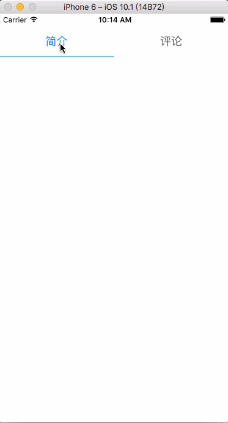

# DSegmentedControl
1. 拷贝`DSegmentedControl.swift`到项目 
2. 初始化`DSegmentedControl.swift`
3. 简单加2个Tab  `segment.titles = ["简介","评论"]`
4. 添加状态变化 `segment.addTarget(self, action: #selector(valueChange), for: UIControlEvents.valueChanged)`
5. `segment.selecteIndex`就是当前选中的Tab

-------

